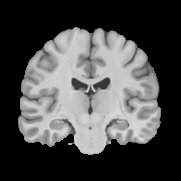
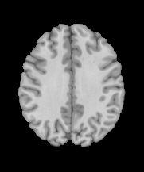
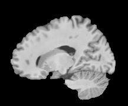
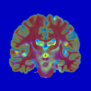
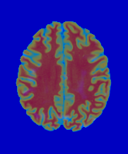
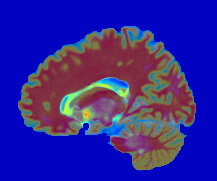
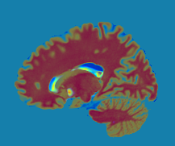
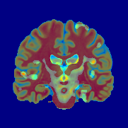
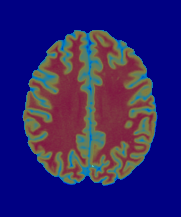
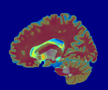

______________________________
______________________________

### Function to Retrieve Commmand Line slices in R TEST
```{r results='hide'}

img_out <- function(coord,filePath,overlay1,newFile) {
  intern = FALSE
  ignore.stdout = FALSE
  ignore.stderr = FALSE
  wait = TRUE
  input = NULL
  
   view1 <- paste0("volblend -r ",filePath," --view 1 --slice ",coord," --flop -o atlas.",coord,".p.png -c jet -i ",overlay1," -o ",newFile,"1.png")
   
  view2 <- paste0("volblend -r ",filePath," --view 2 --slice ",coord," --flop -o atlas.",coord,".p.png -c jet -i ",overlay1," -o ",newFile,"2.png")
  
  view3 <- paste0("volblend -r ",filePath," --view 3 --slice ",coord," --flop -o atlas.",coord,".p.png -c jet -i ",overlay1," -o ",newFile,"3.png")
  
  return(c(system(view1, intern, ignore.stdout, ignore.stderr, wait, input), system(view2, intern, ignore.stdout, ignore.stderr, wait, input), system(view3, intern, ignore.stdout, ignore.stderr, wait, input)))
}

img_out(coord = 107, filePath="/Applications/BrainSuite17a/svreg/BrainSuiteAtlas1/mri.bfc.nii.gz", overlay1="~/Desktop/tbm_anova/bss_anova_age_mri.bfc.nii_log_pvalues.nii.gz", newFile = "Pvalue")
```
<p>
Below, I am test loading all the images of a particular slice. The function should be able to complete the same task.
```{r}
# Atlas View 1
system("volblend -i /Applications/BrainSuite17a/svreg/BrainSuiteAtlas1/mri.bfc.nii.gz --view 2 --slice 107 --flop -o atlas.107.png", intern = FALSE, ignore.stdout = FALSE, ignore.stderr = FALSE, wait = TRUE, input = NULL)
# Atlas View 2
system("volblend -i /Applications/BrainSuite17a/svreg/BrainSuiteAtlas1/mri.bfc.nii.gz --view 3 --slice 107 --flop -o atlas.108.png", intern = FALSE, ignore.stdout = FALSE, ignore.stderr = FALSE, wait = TRUE, input = NULL) 
# Atlas View 3
system("volblend -i /Applications/BrainSuite17a/svreg/BrainSuiteAtlas1/mri.bfc.nii.gz --view 1 --slice 107 --flop -o atlas.106.png", intern = FALSE, ignore.stdout = FALSE, ignore.stderr = FALSE, wait = TRUE, input = NULL)
#P-values View 1
system("volblend -r /Applications/BrainSuite17a/svreg/BrainSuiteAtlas1/mri.bfc.nii.gz --view 2 --slice 107 --flop -o atlas.107.p.png -c jet -i ~/Desktop/tbm_anova/bss_anova_age_mri.bfc.nii_log_pvalues.nii.gz -o Pview1.png", intern = FALSE, ignore.stdout = FALSE, ignore.stderr = FALSE,wait = TRUE, input = NULL)
#P-values View 2
system("volblend -r /Applications/BrainSuite17a/svreg/BrainSuiteAtlas1/mri.bfc.nii.gz --view 3 --slice 107 --flop -o atlas.107.p.png -c jet -i ~/Desktop/tbm_anova/bss_anova_age_mri.bfc.nii_log_pvalues.nii.gz -o Pview2.png", intern = FALSE, ignore.stdout = FALSE, ignore.stderr = FALSE, wait = TRUE, input = NULL)
# P-values View 3
system("volblend -r /Applications/BrainSuite17a/svreg/BrainSuiteAtlas1/mri.bfc.nii.gz --view 1 --slice 107 --flop -o atlas.107.p.png -c jet -i ~/Desktop/tbm_anova/bss_anova_age_mri.bfc.nii_log_pvalues.nii.gz -o Pview3.png", intern = FALSE, ignore.stdout = FALSE, ignore.stderr = FALSE, wait = TRUE, input = NULL)
#Adj P-values View 1
system("volblend -r /Applications/BrainSuite17a/svreg/BrainSuiteAtlas1/mri.bfc.nii.gz --view 2 --slice 107 --flop -o atlas.107.p.png -c jet -i ~/Desktop/tbm_anova/bss_anova_age_mri.bfc.nii_log_pvalues_adjusted.nii.gz -o AdjPvalue1.png", intern = FALSE, ignore.stdout = FALSE, ignore.stderr = FALSE, wait = TRUE, input = NULL)
#Adj P-values View 2
system("volblend -r /Applications/BrainSuite17a/svreg/BrainSuiteAtlas1/mri.bfc.nii.gz --view 3 --slice 107 --flop -o atlas.107.p.png -c jet -i ~/Desktop/tbm_anova/bss_anova_age_mri.bfc.nii_log_pvalues_adjusted.nii.gz -o AdjPvalue2.png", intern = FALSE, ignore.stdout = FALSE, ignore.stderr = FALSE, wait = TRUE, input = NULL)
#Adj P-values View 3
system("volblend -r /Applications/BrainSuite17a/svreg/BrainSuiteAtlas1/mri.bfc.nii.gz --view 1 --slice 107 --flop -o atlas.107.p.png -c jet -i ~/Desktop/tbm_anova/bss_anova_age_mri.bfc.nii_log_pvalues_adjusted.nii.gz -o AdjPvalue3.png", intern = FALSE, ignore.stdout = FALSE, ignore.stderr = FALSE, wait = TRUE, input = NULL)
#Adj P-values View 1
system("volblend -r /Applications/BrainSuite17a/svreg/BrainSuiteAtlas1/mri.bfc.nii.gz --view 2 --slice 107 --flop -o atlas.107.p.png -c jet -i ~/Desktop/tbm_anova/bss_anova_age_mri.bfc.nii_tvalues.nii.gz -o Tvalue1.png", intern = FALSE, ignore.stdout = FALSE, ignore.stderr = FALSE, wait = TRUE, input = NULL)
#Adj P-values View 2
system("volblend -r /Applications/BrainSuite17a/svreg/BrainSuiteAtlas1/mri.bfc.nii.gz --view 3 --slice 107 --flop -o atlas.107.p.png -c jet -i ~/Desktop/tbm_anova/bss_anova_age_mri.bfc.nii_tvalues.nii.gz -o Tvalue2.png", intern = FALSE, ignore.stdout = FALSE, ignore.stderr = FALSE, wait = TRUE, input = NULL)
#Adj P-values View 3
system("volblend -r /Applications/BrainSuite17a/svreg/BrainSuiteAtlas1/mri.bfc.nii.gz --view 1 --slice 107 --flop -o atlas.107.p.png -c jet -i ~/Desktop/tbm_anova/bss_anova_age_mri.bfc.nii_tvalues.nii.gz -o Tvalue3.png", intern = FALSE, ignore.stdout = FALSE, ignore.stderr = FALSE, wait = TRUE, input = NULL)
```

```{r results="asis",tidy=FALSE,eval=TRUE}
t <- "click here: [link1](#test1)"
t
"click here: [link1](#test1)"
```


click here: [link2](#test1)


```{r}
"click here: [link3](#test3)"
"click here: [link1](#test1)"

```

\pagebreak

#Key Clusters {#test1}

```{r}
library(knitr)
t <- c("#test3","#test4","#test5","#test6","#test7")
Cluster <- 1:5
table <- data.frame(Cluster = 1:5, Vol_Size = c(33,22.3, 21, 25, 30), MNI_coord = c(3,3,4,5,3), T_val =c(8,7.2,6,9.8,7.8))
table$Cluster <- paste0("[", table$Cluster, "](", t, ")")
kable(table[1:4], align=c(rep('l', 4)))
```
\pagebreak

# Cluster 1 {#test3}





```{r eval=TRUE, echo=FALSE}

library(shiny)
ui <- fluidPage(
  
    sidebarLayout(
    sidebarPanel("hi"),
    mainPanel("main")
  )
)

shinyUI(fluidPage(
  titlePanel("Overlay"),
  
  navlistPanel(
    tabPanel("P-Values", img(src='./Pview1.png', align="left", width = "45%"),img(src='./Pview3.png', align="left", width = "37.5%"),img(src='./Pview2.png', align="bottom", width = "45%")),
    tabPanel("Adjusted P-values", img(src='./AdjPvalue1.png', align="left", width = "45%"),img(src='./AdjPvalue3.png', align="left", width = "37.5%"),img(src='./AdjPvalue2.png', align="bottom", width = "45%"), img(src='./bss_anova_age_mri.bfc.nii_log_pvalues_cbar.pdf')),
    tabPanel("T-Values", img(src='./Tvalue1.png', align="left", width = "45%"),img(src='./Tvalue3.png', align="left", width = "37.5%"),img(src='./Tvalue2.png', align="bottom", width = "45%"))
  )
))
```


####Return to table: [here](#test1)
______________________________

\pagebreak

# Cluster 2 {#test4}
####Return to table: [here](#test1)

\pagebreak

# Cluster 3 {#test5}
####Return to table: [here](#test1)

\pagebreak

# Cluster 4 {#test6}
####Return to table: [here](#test1)

\pagebreak

# Cluster 5 {#test7}
####Return to table: [here](#test1)


<p>
<p>

# tbm - visualization
______________________________
###Atlas


<p>


```{r}
knitr::include_graphics(c("~/atlas.107.png","~/atlas.108.png","~/atlas.106.png"))
```

###P-Values
______________________________
```{r}
#knitr::include_graphics(c("~/Pview1.png","~/Pview2.png","~/Pview3.png"))
```



<p>


###Adjusted P-Values
______________________________


<p>


###T-Values
______________________________



<p>


\pagebreak


```{r}
library(shiny)
library(shinyjs)


  shinyUI(fluidPage(
    useShinyjs(),
    tabsetPanel(
      id = "navbar",
      tabPanel(title = "Cluster 1",
              checkboxGroupInput("variable", "Variables to show:",
                     c("P-Values" = "p",
                       "Adjusted P-val" = "adp",
                       "T-Values" = "t",
                       "Atlas" = "at"), inline=T, selected = c("p","adp","t","at")),
  tableOutput("data"),
               value = c("Cluster 1"),
               h1("Tab 1"),
              img(src='./Pview1.png', align="left", width = "30%"),
               img(src='./Pview3.png', align="left", width = "25%"),
               img(src='./Pview2.png', align="left", width = "36%"),
  img(src='./AdjPvalue1.png', align="left", width = "30%"),
  img(src='./AdjPvalue3.png', align="left", width = "25%"),
  img(src='./AdjPvalue2.png', align="bottom", width = "36%"), knitr::include_graphics('/Users/sarapesavento/Desktop/tbm_anova/bss_anova_age_mri.bfc.nii_log_pvalues_cbar.pdf', auto_pdf=TRUE)),
      tabPanel(title = "Cluster 2",
               value = "tab2",
               h1("Tab 2")

      ),
      tabPanel(title = "Cluster 3",
               value = "tab3",
               h1("Tab 3")
      )
    )
  )  )
```

```{r}
library(shiny)

ui <- fluidPage(
  sidebarLayout(
    sidebarPanel("hi"),
    mainPanel("main")
  )
)

  shinyUI(fluidPage(
    tabsetPanel(
      id = "navbar",
      tabPanel(title = "tab1",
               value = "tab1",
               navlistPanel(
    "P-Values",
    widths = c(4,8),
    tabPanel("Overlay P-Values", img(src='./Pview1.png', align="left", width = "45%"),img(src='./Pview3.png', align="left", width = "37.5%"),img(src='./Pview2.png', align="bottom", width = "45%")))),
            
      tabPanel(title = "tab2",
               value = "tab2",
               h1("Tab 2")

      ),
      tabPanel(title = "tab3",
               value = "tab3",
               h1("Tab 3")
      )
    )
  )  )
```


#test 2 {#test2}
```{r eval=TRUE}

library(shiny)
ui <- fluidPage(
  
  sidebarLayout(
    sidebarPanel("hiiiiiiiiii"),
    mainPanel("main")
  )
)


shinyUI(fluidPage(
  titlePanel("Cluster 1"),
  
  navlistPanel(
    "P-Values",
    tabPanel("Overlay P-Values", img(src='./Pview1.png', align="left", width = "45%"),img(src='./Pview3.png', align="left", width = "37.5%"),img(src='./Pview2.png', align="bottom", width = "45%")),
    tabPanel("Colormap P"),
       "Adjusted P-values",
    tabPanel("Adjusted P-values", img(src='./AdjPvalue1.png', align="left", width = "45%"),img(src='./AdjPvalue3.png', align="left", width = "37.5%"),img(src='./AdjPvalue2.png', align="bottom", width = "45%")),
    tabPanel("Colormap Adj P"),
    "T-Values",
    tabPanel("Overlay T-Values", img(src='./Tvalue1.png', align="left", width = "45%"),img(src='./Tvalue3.png', align="left", width = "37.5%"),img(src='./Tvalue2.png', align="bottom", width = "45%")),
    tabPanel("Colormap T")
  )
))
```

####Return to table: [here](#test1)


```{r}
ui <- fluidPage(
  textOutput("txt")
)

shinyUI(fluidPage(

  tags$head(
    tags$link(rel = "stylesheet", type = "text/css", href = "bootstrap.css")
  ),

  headerPanel(radioButtons("radio_year_select","Year", c("1999" = "1999", "2001" = "2001", "303430432=303430432", "948139483914"="948139483914"), inline=T)),
  
  sidebarPanel(
    radioButtons("radio_year_select","Year", c("1999" = "1999", "2001" = "2001", "948139483914"="948139483914"), inline=T)
  ),
  
  mainPanel(plotOutput("distPlot"))
))
```


